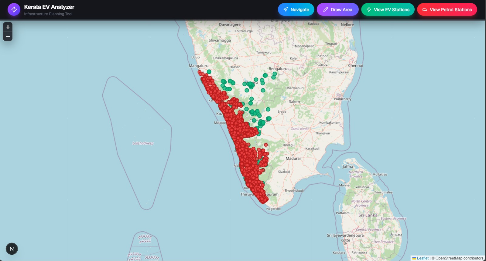
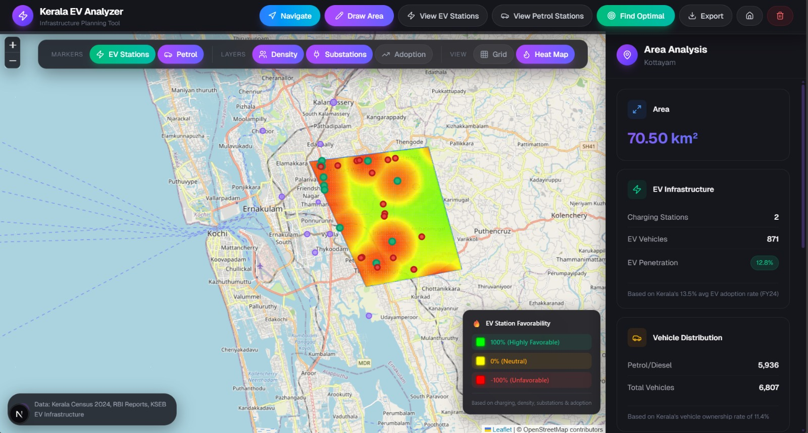
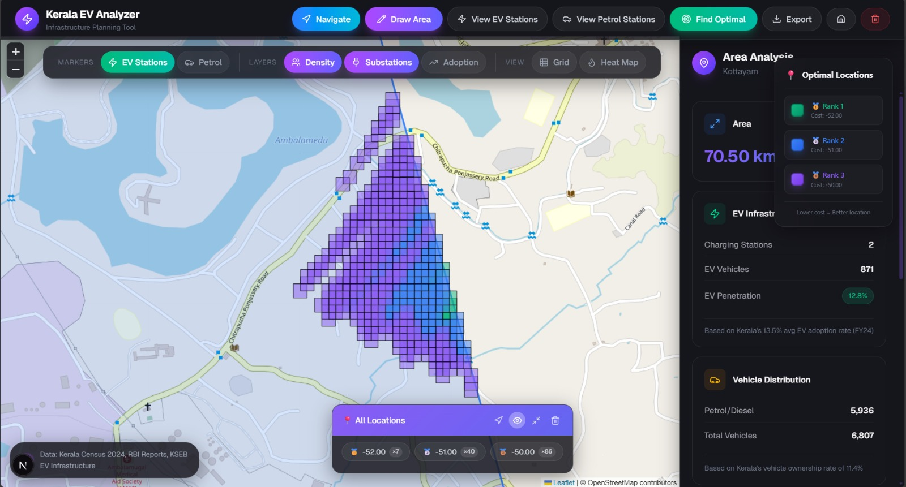
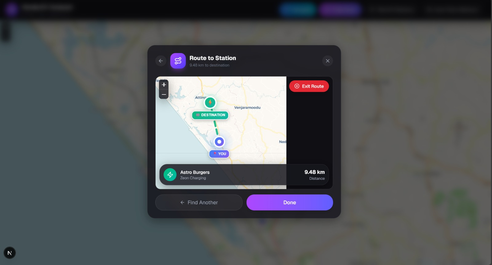

<div align="center">

# ⚡ Kerala EV Charging Infrastructure Optimizer

### *Data-Driven Sustainable Mobility Planning for India's First EV State*

[](https://nodejs.org/)
[](https://nextjs.org/)
[](https://python.org/)
[](https://flask.palletsprojects.com/)
[](https://leafletjs.com/)
[](https://sqlite.org/)

[](https://sdgs.un.org/goals/goal7)
[](https://sdgs.un.org/goals/goal11)
[](https://sdgs.un.org/goals/goal13)

<br/>

[🚀 Quick Start](#-quick-start) •
[📖 Documentation](#-documentation) •
[🎯 Features](#-key-features) •
[❓ FAQ](#-frequently-asked-questions)

</div>

---

## 📋 Table of Contents

- [What is This Project?](#-what-is-this-project)
- [Why is This Important?](#-why-is-this-important)
- [Key Features](#-key-features)
- [Screenshots](#-screenshots)
- [Tech Stack](#-tech-stack)
- [Quick Start](#-quick-start)
- [Project Structure](#-project-structure)
- [Data Flow & Workflow](#-data-flow--workflow)
- [SDG Alignment](#-sdg-alignment)
- [API Reference](#-api-reference)
- [Frequently Asked Questions](#-frequently-asked-questions)
- [Contributing](#-contributing)
- [License](#-license)
- [Acknowledgments](#-acknowledgments)

---

## 🎯 What is This Project?

**Kerala EV Charging Infrastructure Optimizer** is an interactive geospatial decision-support platform that helps identify **optimal locations for electric vehicle (EV) charging stations** across Kerala, India.

The platform combines **multi-layer spatial analysis**, **real-time navigation**, and **data visualization** to serve:

| User Type | Use Case |
|-----------|----------|
| 🏛️ **Government Planners** | Strategic infrastructure investment decisions |
| ⚡ **Charge Point Operators** | Site selection for new charging stations |
| 🏢 **Real Estate Developers** | EV-readiness assessment for new projects |
| 🚗 **EV Owners** | Find and navigate to nearest charging stations |
| ⛽ **Petrol Station Owners** | Evaluate conversion potential to EV charging |

### 🔑 Core Capabilities

```
┌─────────────────────────────────────────────────────────────────┐
│  📍 Draw Any Area  →  🔬 Analyze  →  🎯 Get Optimal Locations   │
└─────────────────────────────────────────────────────────────────┘
```

1. **Draw-to-Analyze**: Draw custom polygons on any Kerala region for instant analysis
2. **4-Layer Cost Analysis**: Considers charging station proximity, population density, power grid connectivity, and EV adoption likelihood
3. **Heat Map Visualization**: See favorability scores as GREEN (optimal) → YELLOW → RED
4. **Multi-Rank Results**: Get top N alternative locations, not just "the best" one
5. **Real-time Navigation**: Find and route to nearest EV or petrol station using GPS

---

## 🌍 Why is This Important?

### The Problem

| Metric | Current State | Ideal State |
|--------|---------------|-------------|
| **EV-to-Charger Ratio** | 117:1 | 50:1 (IEA Standard) |
| **Public Charging Stations** | ~600 | 20,000+ (by 2030) |
| **Registered EVs in Kerala** | 70,000+ | 1,000,000 (2030 Target) |
| **Rural Charger Coverage** | 18% | 40%+ |

**Key Challenges:**
- ❌ **Range Anxiety**: #1 barrier to EV adoption
- ❌ **Random Placement**: Leads to underutilization in some areas, overcrowding in others
- ❌ **Wasted Investment**: ₹2,000+ Crore lost annually on suboptimal infrastructure
- ❌ **Urban-Rural Gap**: 2x disparity between urban and rural charging coverage

### Our Solution

> *"Without data-driven planning, Kerala's 1 Million EVs by 2030 goal is at risk."*

This tool transforms **guesswork into science** by:

- 📊 Analyzing **4 weighted factors** for every grid cell in a region
- 🎯 Ranking locations from **best to worst** with transparent cost scores
- 🗺️ Visualizing **2,503 petrol stations** as potential conversion sites
- 📈 Using **73 local body population zones** for density calculations
- ⚡ Considering **power substation proximity** for grid connectivity

---

## ✨ Key Features

### For Infrastructure Planners

| Feature | Description |
|---------|-------------|
| 🎨 **Polygon Drawing** | Draw any custom shape to analyze - no predefined boundaries |
| 📊 **Multi-Layer Visualization** | Toggle EV stations, petrol stations, density, substations, adoption rates |
| 🔥 **Heat Map** | See composite scores as color gradients (green = optimal) |
| 🏆 **N-Rank Finder** | Get top 1-10 locations ranked by cost score |
| 🔍 **Region Browser** | Filter and navigate between sub-locations in same rank |
| 📤 **JSON Export** | Export analysis results for GIS integration |

### For EV Owners

| Feature | Description |
|---------|-------------|
| 📍 **View All Stations** | See 600+ EV charging stations and 2,503 petrol stations |
| 🧭 **Find Nearest** | Locate nearest EV or petrol station from your GPS location |
| 🗺️ **Route Map** | Embedded mini-map shows route with distance |
| 📱 **Mobile Friendly** | Responsive design works on any device |

---

## � Screenshots

### 🗺️ EV & Petrol Station Map
View all **600+ EV charging stations** (green markers) and **2,503 petrol stations** (red markers) across Kerala at a glance. This visualization instantly reveals the infrastructure gap — where EVs can charge vs. where fossil fuel infrastructure dominates.

<div align="center">

</div>

---

### 📊 Area Analysis with Grid View
Draw any custom polygon on the map to trigger **instant area analysis**. The Grid View divides your selected region into analyzable cells while the **Stats Panel** displays key metrics — area size, charging stations count, EV vehicles estimate, EV penetration rate, and vehicle distribution.

<div align="center">

</div>

---

### 🔥 Heat Map Visualization
Toggle to **Heat Map View** to see composite favorability scores as a color gradient:
- 🟢 **Green (100%)** — Highly favorable for new EV stations
- 🟡 **Yellow (0%)** — Neutral zones
- 🔴 **Red (-100%)** — Unfavorable (already saturated or low demand)

The algorithm considers **4 weighted factors**: charging proximity, population density, substation distance, and EV adoption likelihood.

<div align="center">

</div>

---

### 🏆 Optimal Location Finder
Click **"Find Optimal"** to compute the best locations for new charging stations. The system uses a **divide-and-conquer algorithm** to rank locations by cost score:
- **Rank 1** (Green) — Best locations (lowest cost)
- **Rank 2** (Blue) — Second-best alternatives  
- **Rank 3** (Purple) — Third-tier options

Each rank shows how many sub-locations share that score, enabling planners to choose from multiple equally-good sites.

<div align="center">

</div>

---

### 🧭 Navigation & Routing
For EV owners: Click **"Navigate"** to find the nearest charging station. The modal displays:
- **Embedded mini-map** with your route
- **Station name** and operator
- **Distance** to destination
- Option to **"Find Another"** if preferred

<div align="center">

</div>

---

## �🛠️ Tech Stack

<table>
<tr>
<td valign="top" width="50%">

### Frontend
| Technology | Purpose |
|------------|---------|
| [Next.js 14](https://nextjs.org/) | React framework with App Router |
| [React 19](https://react.dev/) | UI component library |
| [Leaflet.js](https://leafletjs.com/) | Interactive map visualization |
| [Tailwind CSS](https://tailwindcss.com/) | Utility-first styling |
| [Lucide React](https://lucide.dev/) | Icon library |

</td>
<td valign="top" width="50%">

### Backend
| Technology | Purpose |
|------------|---------|
| [Flask](https://flask.palletsprojects.com/) | Python web framework |
| [NumPy](https://numpy.org/) | Numerical computations |
| [SciPy](https://scipy.org/) | Spatial indexing (KDTree) |
| [SQLite](https://sqlite.org/) | Embedded database |
| [Flask-CORS](https://flask-cors.readthedocs.io/) | Cross-origin requests |

</td>
</tr>
</table>

### Architecture Overview

```
┌────────────────────┐     ┌────────────────────┐     ┌────────────────────┐
│   Next.js Frontend │────▶│  Next.js API Routes │────▶│   SQLite Database  │
│   (Leaflet Maps)   │     │   /api/stations     │     │   (source.db)      │
└────────────────────┘     └────────────────────┘     └────────────────────┘
         │                                                       │
         │                 ┌────────────────────┐                │
         └────────────────▶│   Flask Backend    │◀───────────────┘
                           │   :5000/api/...    │
                           └────────────────────┘
```

---

## 🚀 Quick Start

### Prerequisites

| Requirement | Version | Check Command |
|-------------|---------|---------------|
| Node.js | ≥ 18.0.0 | `node --version` |
| Python | ≥ 3.8 | `python --version` |
| npm/yarn/pnpm | Any | `npm --version` |

### Installation

```bash
# 1. Clone the repository
git clone https://github.com/KenYeager/KERALA-MAP-ANALYSER.git
cd KERALA-MAP-ANALYSER

# 2. Install frontend dependencies
npm install

# 3. Install backend dependencies
cd backend
pip install flask flask-cors numpy scipy
cd ..
```

### Running the Application

#### Terminal 1: Start Frontend
```bash
npm run dev
# ✓ Ready at http://localhost:3000
```

#### Terminal 2: Start Backend
```bash
cd backend
python app.py
# ✓ Running on http://localhost:5000
```

### Verify Installation

Open [http://localhost:3000](http://localhost:3000) in your browser. You should see:
- 🗺️ Map of Kerala centered at coordinates (10.8505, 76.2711)
- 🟢 Green markers showing EV charging stations
- 🔴 Red markers showing petrol stations

---

## 📁 Project Structure

```
KERALA-MAP-ANALYSER/
├── 📂 backend/                    # Flask Python backend
│   ├── app.py                     # Main Flask application (471 lines)
│   ├── evStationsLoader.py        # EV station database queries
│   ├── petrolStationsLoader.py    # Petrol station database queries
│   └── test_api.py                # API testing utilities
│
├── 📂 cleaning/                   # Data preparation & database
│   ├── source.db                  # SQLite database (≈7MB)
│   ├── ev-charging-station.csv    # Raw EV station data (89K+ records)
│   ├── petrol.csv                 # Kerala petrol stations (2,503 records)
│   ├── kerala_local_body_indicators.csv  # Population/density data
│   ├── import_to_sqlite.py        # ETL script for importing data
│   ├── verify_db.py               # Database verification script
│   └── clearner.py                # Data cleaning utilities
│
├── 📂 public/                     # Static assets
│
├── 📂 src/
│   ├── 📂 app/                    # Next.js App Router
│   │   ├── layout.js              # Root layout
│   │   ├── page.js                # Homepage
│   │   ├── globals.css            # Global styles + animations
│   │   └── 📂 api/                # API routes
│   │       ├── stations/route.js  # GET /api/stations
│   │       ├── population_density/route.js
│   │       └── adoption_likelihood/route.js
│   │
│   ├── 📂 components/             # React components
│   │   ├── KeralMapAnalyzer.js    # Main orchestrator (1,122 lines)
│   │   ├── Header.jsx             # Top toolbar
│   │   ├── MapView.jsx            # Leaflet map container
│   │   ├── StatsPanel.jsx         # Analysis sidebar
│   │   ├── NavigationMenu.jsx     # Find nearest station modal
│   │   ├── OptimalLocationModal.jsx  # N-locations input dialog
│   │   ├── RegionSelector.jsx     # Rank filter & navigation
│   │   └── 📂 stats/              # Stats panel cards
│   │       ├── AreaCard.jsx
│   │       ├── EVInfrastructureCard.jsx
│   │       ├── VehicleDistributionCard.jsx
│   │       ├── DemographicsCard.jsx
│   │       └── ...
│   │
│   └── 📂 utils/                  # Utility modules
│       ├── mapUtils.js            # Leaflet helpers, area calculations
│       ├── districtData.js        # 14 Kerala districts metadata
│       ├── optimalLocationFinder.js       # Visualization logic
│       ├── optimalLocationFinderAPI.js    # Backend API client
│       ├── heatMapLayer.js        # Heat map generation
│       ├── populationDensityLayer.js      # Density overlay
│       ├── substationsLayer.js    # Power substations
│       └── adoptionLikelihoodLayer.js     # EV adoption scoring
│
├── 📄 TECHNICAL_DOCUMENTATION.md  # Detailed algorithm documentation
├── 📄 package.json                # Node.js dependencies
├── 📄 next.config.mjs             # Next.js configuration
├── 📄 tailwind.config.js          # Tailwind CSS configuration
└── 📄 README.md                   # This file
```

---

## 🔄 Data Flow & Workflow

### User Journey: Finding Optimal Locations

```
┌─────────────┐     ┌─────────────┐     ┌─────────────┐     ┌─────────────┐
│  1. DRAW    │────▶│  2. ANALYZE │────▶│  3. COMPUTE │────▶│  4. DISPLAY │
│   Polygon   │     │    Area     │     │   Optimal   │     │   Results   │
└─────────────┘     └─────────────┘     └─────────────┘     └─────────────┘
      │                   │                   │                   │
      ▼                   ▼                   ▼                   ▼
 Click points        Calculate:          Flask backend        Heat map +
 on map to         • Area (km²)         processes grid       Ranked regions
 create polygon    • Population          with 4-factor       with boundaries
                   • EV penetration      cost algorithm
```

### Algorithm: 4-Factor Cost Calculation

Each grid cell receives a **cost score** from -100 (excellent) to +100 (poor):

```
TOTAL_COST = (Proximity × 0.30) + (Density × 0.25) + (Substation × 0.25) + (Adoption × 0.20)
```

| Factor | Weight | Logic |
|--------|--------|-------|
| **Charging Proximity** | 30% | PENALIZE cells near existing chargers (avoid clustering) |
| **Population Density** | 25% | FAVOR high-density areas (more users) |
| **Substation Distance** | 25% | FAVOR cells near power substations (cheaper grid connection) |
| **Adoption Likelihood** | 20% | FAVOR areas with high EV adoption propensity |

### Divide-and-Conquer Zone Processing

```
┌────────────────────────────────────────────────────────────┐
│                    ALL GRID CELLS                          │
├────────────────┬───────────────────┬───────────────────────┤
│   🟢 GREEN     │    🟡 YELLOW      │      🔴 RED           │
│  cost ≤ -33   │  -33 < cost ≤ 33  │    cost > 33         │
│  (Favorable)   │   (Neutral)       │   (Unfavorable)      │
├────────────────┴───────────────────┴───────────────────────┤
│  Process GREEN first → If N ranks found, STOP             │
│  Only process YELLOW if more ranks needed                  │
│  Only process RED as last resort                           │
└────────────────────────────────────────────────────────────┘
```

### Database Schema

The SQLite database (`cleaning/source.db`) contains **6 tables** with Kerala infrastructure data:

```sql
-- ═══════════════════════════════════════════════════════════════════
-- TABLE 1: ev_stations (574 records)
-- Source: Open Charge Map API (filtered for Kerala)
-- Used by: Charging Proximity Cost Layer (30% weight)
-- ═══════════════════════════════════════════════════════════════════
ev_stations
├── id              INTEGER PRIMARY KEY
├── latitude        REAL        -- GPS latitude
├── longitude       REAL        -- GPS longitude
├── status_code     INTEGER     -- Station operational status
├── access_code     INTEGER     -- Public/Private access
├── name            TEXT        -- Station name
├── operator        TEXT        -- Operating company
├── usage_type      TEXT        -- Type of usage
├── power_kw        REAL        -- Charging power in kW
└── connectors      TEXT        -- Connector types available

-- ═══════════════════════════════════════════════════════════════════
-- TABLE 2: petrol_stations (2,503 records)
-- Source: OpenStreetMap (Kerala bounding box)
-- Used by: Navigation feature (Find Nearest Station)
-- ═══════════════════════════════════════════════════════════════════
petrol_stations
├── id              INTEGER PRIMARY KEY
├── latitude        REAL        -- GPS latitude
├── longitude       REAL        -- GPS longitude
├── name            TEXT        -- Station name
├── operator        TEXT        -- Operating company
├── brand           TEXT        -- Fuel brand (IOCL, BPCL, etc.)
├── city            TEXT        -- City/town location
├── phone           TEXT        -- Contact number
└── website         TEXT        -- Website URL

-- ═══════════════════════════════════════════════════════════════════
-- TABLE 3: population_density (73 records)
-- Source: Kerala Local Body Indicators (Census)
-- Used by: Population Density Cost Layer (25% weight)
-- ═══════════════════════════════════════════════════════════════════
population_density
├── latitude        REAL        -- Zone centroid latitude
├── longitude       REAL        -- Zone centroid longitude
├── population      INTEGER     -- Total population in zone
├── density_per_m2  REAL        -- People per square meter
├── per_capita_income REAL      -- Average income (₹)
└── area            REAL        -- Zone area in sq km

-- ═══════════════════════════════════════════════════════════════════
-- TABLE 4: adoption_likelihood (73 records)
-- Source: Derived from census + vehicle registration data
-- Used by: EV Adoption Likelihood Cost Layer (20% weight)
-- ═══════════════════════════════════════════════════════════════════
adoption_likelihood
├── latitude        REAL        -- Zone centroid latitude
├── longitude       REAL        -- Zone centroid longitude
├── population      INTEGER     -- Total population
├── ev_adoption_likelihood_score REAL  -- 0-100 score (higher = more likely to adopt EV)
├── per_capita_income REAL      -- Average income (₹)
└── area            REAL        -- Zone area in sq km

-- ═══════════════════════════════════════════════════════════════════
-- TABLE 5: SUBSTATIONS (116 records)
-- Source: Kerala State Electricity Board (KSEB)
-- Used by: Substation Proximity Cost Layer (25% weight)
-- ═══════════════════════════════════════════════════════════════════
SUBSTATIONS
├── Latitude        REAL        -- GPS latitude
├── Longitude       REAL        -- GPS longitude
└── Voltage_kV      REAL        -- Voltage capacity in kV

-- ═══════════════════════════════════════════════════════════════════
-- TABLE 6: EV_VEHICLES_PER_DISTRICT (67 records)
-- Source: Kerala Motor Vehicle Department
-- Used by: Stats Panel (Vehicle Distribution Card)
-- ═══════════════════════════════════════════════════════════════════
EV_VEHICLES_PER_DISTRICT
├── district        TEXT        -- District name
├── ev_count        INTEGER     -- Number of registered EVs
├── latitude        REAL        -- District centroid lat
└── longitude       REAL        -- District centroid lng
```

---

## 🗂️ Layer Calculations & Cost Factors

The algorithm evaluates each grid cell using **4 weighted cost factors**. Lower total cost = more favorable for new EV charging station.

### Cost Formula

```
TOTAL_COST = (Proximity × 0.30) + (Density × 0.25) + (Substation × 0.25) + (Adoption × 0.20)
```

### Layer 1: Charging Station Proximity (30% Weight)

**Purpose:** PENALIZE cells near existing chargers to avoid clustering

| Parameter | Value | Description |
|-----------|-------|-------------|
| `MAX_PENALTY_DISTANCE` | 2.0 km | Beyond this, cells get negative cost (bonus) |
| `MAX_PENALTY_COST` | +100 | Cost at station location (worst) |
| `NEGATIVE_BONUS_CAP` | -50 | Maximum bonus for distant cells |

**Algorithm:**
```
if distance ≤ 2km:
    penalty = (1 - (distance/2)²) × 100    // Quadratic decay
else:
    bonus = min(50, (distance - 2) × 10)   // Linear bonus, capped at -50
```

**Database Fields Used:** `ev_stations.latitude`, `ev_stations.longitude`

---

### Layer 2: Population Density (25% Weight)

**Purpose:** FAVOR high-density areas (more potential EV users)

| Parameter | Value | Description |
|-----------|-------|-------------|
| `WEIGHT` | -10,000 | Multiplier for density_per_m2 |
| `INFLUENCE_RADIUS` | Based on zone area | √(area/π) in km |

**Algorithm:**
```
For each density zone within influence radius:
    contribution = density_per_m2 × WEIGHT × decay_factor
    cell.cost += contribution
```

**Database Fields Used:** `population_density.latitude`, `population_density.longitude`, `population_density.density_per_m2`, `population_density.area`

---

### Layer 3: Substation Proximity (25% Weight)

**Purpose:** FAVOR cells near power substations (cheaper grid connection)

| Parameter | Value | Description |
|-----------|-------|-------------|
| `MAX_BENEFIT_DISTANCE` | 5.0 km | Influence radius |
| `MAX_BENEFIT_COST` | -50 | Cost reduction at substation (best) |

**Algorithm:**
```
if distance ≤ 5km:
    benefit = (1 - distance/5) × (-50) × voltage_factor
    cell.cost += benefit
```

Higher voltage substations provide stronger cost benefits.

**Database Fields Used:** `SUBSTATIONS.Latitude`, `SUBSTATIONS.Longitude`, `SUBSTATIONS.Voltage_kV`

---

### Layer 4: EV Adoption Likelihood (20% Weight)

**Purpose:** FAVOR areas with high EV adoption propensity

| Parameter | Value | Description |
|-----------|-------|-------------|
| `INFLUENCE_RADIUS_KM` | 3.0 km | Fixed influence radius |
| `MAX_COST_REDUCTION` | -20 | Maximum bonus for high adoption areas |

**Algorithm:**
```
For each adoption zone within 3km:
    score = ev_adoption_likelihood_score (0-100 scale)
    decay = 1 - (distance / 3000)²
    cost_reduction = (score / 100) × (-20) × decay
    cell.cost += cost_reduction
```

**Database Fields Used:** `adoption_likelihood.latitude`, `adoption_likelihood.longitude`, `adoption_likelihood.ev_adoption_likelihood_score`

---

### Cost Interpretation

| Cost Range | Color | Meaning |
|------------|-------|---------|
| ≤ -33 | 🟢 GREEN | Highly favorable - optimal for new station |
| -33 to +33 | 🟡 YELLOW | Neutral - acceptable but not ideal |
| > +33 | 🔴 RED | Unfavorable - too close to existing infrastructure |

---

## 🌱 SDG Alignment

This project directly contributes to **4 United Nations Sustainable Development Goals**:

<table>
<tr>
<td width="25%" align="center">

<br/><b>SDG 7</b><br/>Affordable & Clean Energy
</td>
<td width="25%" align="center">

<br/><b>SDG 11</b><br/>Sustainable Cities
</td>
<td width="25%" align="center">

<br/><b>SDG 13</b><br/>Climate Action
</td>
<td width="25%" align="center">

<br/><b>SDG 17</b><br/>Partnerships
</td>
</tr>
</table>

| SDG | Our Contribution | Measurable Impact |
|-----|------------------|-------------------|
| **SDG 7** | Identify underserved areas for clean energy infrastructure | 40% coverage increase in rural areas |
| **SDG 11** | Optimize station placement to reduce urban congestion | 30% reduction in average wait times |
| **SDG 13** | Accelerate EV adoption by removing infrastructure barriers | Support Kerala's 1M EV target by 2030 |
| **SDG 17** | Open-source platform for government + private sector collaboration | Multi-stakeholder data integration |

### Kerala EV Policy Alignment

- ✅ First Indian state with dedicated EV policy (2019)
- ✅ Target: 1 million EVs by 2030
- ✅ This tool directly supports ANERT infrastructure planning

---

## 📡 API Reference

### Next.js API Routes (Frontend)

| Method | Endpoint | Description |
|--------|----------|-------------|
| GET | `/api/stations?type=ev` | Fetch all EV charging stations |
| GET | `/api/stations?type=petrol` | Fetch all petrol stations |
| POST | `/api/population_density` | Get density data for bounds |
| POST | `/api/adoption_likelihood` | Get adoption scores for bounds |

### Flask API Routes (Backend)

| Method | Endpoint | Description |
|--------|----------|-------------|
| GET | `/api/health` | Backend health check |
| POST | `/api/find-optimal-locations` | Compute optimal locations for polygon |

#### Example: Find Optimal Locations

```bash
curl -X POST http://localhost:5000/api/find-optimal-locations \
  -H "Content-Type: application/json" \
  -d '{
    "cells": [...],
    "n": 5,
    "minDistanceKm": 0.5
  }'
```

**Response:**
```json
{
  "success": true,
  "executionTime": 0.245,
  "cellsProcessed": 847,
  "locations": [
    {
      "costRank": 1,
      "cost": -55.00,
      "subLocationCount": 3,
      "subLocations": [...]
    }
  ]
}
```

---

## ❓ Frequently Asked Questions

<details>
<summary><b>Q: What data sources does this project use?</b></summary>

The project uses:
- **EV Stations**: OpenChargeMap API + OpenStreetMap
- **Petrol Stations**: OpenStreetMap Kerala extract (2,503 stations)
- **Population Data**: Kerala Local Body Indicators (73 zones)
- **Adoption Likelihood**: Computed from income + existing EV registrations
</details>

<details>
<summary><b>Q: Can I use this for areas outside Kerala?</b></summary>

Currently, the data is specific to Kerala. However, the codebase is modular—you can:
1. Replace `source.db` with your region's data
2. Update coordinate bounds in `districtData.js`
3. Adjust cost calculation weights in `backend/app.py`
</details>

<details>
<summary><b>Q: How accurate are the optimal location recommendations?</b></summary>

The algorithm considers 4 factors with configurable weights. Accuracy depends on:
- Data freshness (EV stations update regularly)
- Population density accuracy (2021 Census data)
- Substation data completeness

For production use, we recommend validating top recommendations with field surveys.
</details>

<details>
<summary><b>Q: Does this work offline?</b></summary>

Partially. The SQLite database works offline, but:
- Map tiles require internet (CartoDB Voyager tiles)
- Routing uses browser geolocation (requires network)

For fully offline use, consider caching map tiles with a tile server.
</details>

<details>
<summary><b>Q: How do I add more EV stations to the database?</b></summary>

```bash
cd cleaning
# Edit import_to_sqlite.py with your data source
python import_to_sqlite.py
python verify_db.py  # Verify the import
```
</details>

<details>
<summary><b>Q: What's the maximum polygon size I can analyze?</b></summary>

The system uses adaptive grid sizing:
- < 10 km²: 50m² cells (high precision)
- 10-50 km²: 100m² cells
- 50-100 km²: 200m² cells
- > 100 km²: 500m² cells (warns user)

Very large polygons (> 500 km²) may take 10+ seconds to process.
</details>

<details>
<summary><b>Q: Can I export the analysis results?</b></summary>

Yes! Click the **Export** button in the header to download:
- Polygon coordinates
- All ranked locations with cost scores
- Cell-level data for GIS import (JSON format)
</details>

---

## 🤝 Contributing

Contributions are welcome! Here's how you can help:

1. **Report Bugs**: Open an issue describing the bug
2. **Request Features**: Open an issue with the `enhancement` label
3. **Submit PRs**: Fork, create a branch, make changes, submit PR

### Development Guidelines

- Follow existing code style (ESLint + Prettier)
- Test changes locally before submitting
- Update documentation for new features
- Add comments for complex algorithms

---

## 📄 License

This project is developed for the **Asian Management Hackathon 2026**.

---

## 🙏 Acknowledgments

- **[Kerala ANERT](https://anert.gov.in/)** - EV policy framework and charging data
- **[OpenChargeMap](https://openchargemap.org/)** - Global EV charging station database
- **[OpenStreetMap](https://openstreetmap.org/)** - Kerala petrol station data
- **[Leaflet.js](https://leafletjs.com/)** - Open-source mapping library
- **[CartoDB](https://carto.com/)** - Map tile services (Voyager theme)

---

<div align="center">

### Built with ❤️ for a Sustainable Kerala

**[⬆ Back to Top](#-kerala-ev-charging-infrastructure-optimizer)**

</div>
